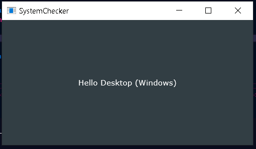

# SystemChecker App

## Description
This application is designed to determine the type of operating system it is running on and display an appropriate message in the application window. It uses the JUCE framework to create the graphical interface.

## Macros Used
In the `MainComponent.cpp` file, preprocessor macros are used to determine the operating system:

```bash
#if JUCE_WINDOWS message = "Hello Desktop (Windows)";
#elif JUCE_IOS message = "Hello iPhone";
#else message = "Unknown System"; #endif
```

### Explanation of Macros
- `#if JUCE_WINDOWS`: This macro checks if the application is running on a Windows system. If the condition is true, the message is set to "Hello Desktop (Windows)".
- `#elif JUCE_IOS`: This macro checks if the application is running on an iOS system (iPhone). If the condition is true, the message is set to "Hello iPhone".
- `#else`: If none of the previous conditions are true, the message is set to "Unknown System".

### Usage
These macros allow the application to adapt its behavior based on the operating system it is running on. In this case, the message displayed in the application window changes depending on the detected operating system.

## Execution
When the application is run, the appropriate message is displayed in the center of the application window, thanks to the label (`juce::Label`) configured in the `MainComponent` class constructor.

```bash
systemLabel.setText(message, jucedontSendNotification);
systemLabel.setJustificationType(juceJustification::centred);
addAndMakeVisible(systemLabel);
```

## Requirements
- JUCE framework
- C++ compiler compatible with C++17

## Compilation
To compile the application, make sure you have properly set up your development environment with the JUCE framework and a C++ compiler compatible with C++17.

## Screenshots
Here are some screenshots of the application running on different systems:

### Windows


### iPhone

